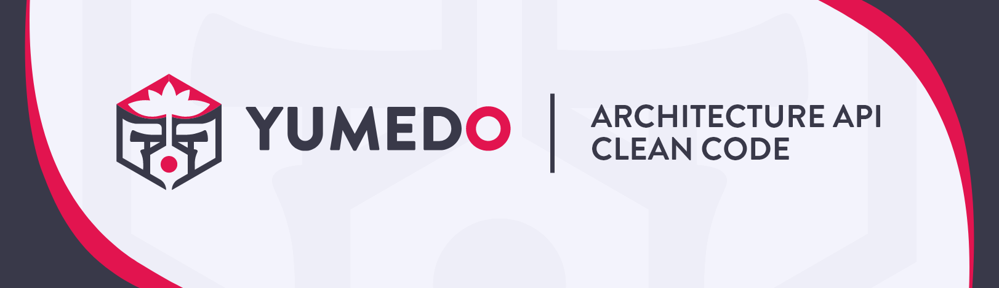

# Yumedo Template



## Authors: [Yumi](https://github.com/helene-nguyen) & [Fredo](https://github.com/Megafredo)

---

## Introduction

This repository contains a starter template for user authentication and CRUD operations.

This API was inspired by some concepts from the hexagonal architecture work of Dr. [Alistair Cockburn](https://alistair.cockburn.us/hexagonal-architecture/) in an article he wrote in 2005.

Ports & Adapters is a pattern that promotes decoupling from technology and frameworks.

## Summary

- [Requirements](#requirements)
- [Tools and version](#tools-and-versions)
- [Folder structure](#folder-structure)
- [Makefile usage](#makefile-usage)
- [Some tips](#tips)

- [Sources](#sources)

## Requirements

Having NodeJS installed.

Install all dependencies:

```sh
npm i
```

Don't forget to add .env file. You'll find an example.

## Tools and versions

- OS

  - Linux OS -
  - Windows OS -

- IDE

  - VSCodium v1.77.3

- NodeJS v20.0.0
- Typescript v5.0.4

- Dependencies

```json
"dependencies": {
    "ajv": "^8.12.0",
    "bcrypt": "^5.1.0",
    "debug": "^4.3.4",
    "dotenv": "^16.0.3",
    "express-session": "^1.17.3",
    "helmet": "^6.1.5",
    "jsonwebtoken": "^9.0.0",
    "nodemailer": "^6.9.1",
    "pg": "^8.10.0",
    "swagger-jsdoc": "^6.2.8",
    "swagger-ui-express": "^4.6.2"
  }
```

- Dev dependencies

```json
  "devDependencies": {
    "@faker-js/faker": "^7.6.0",
    "@types/bcrypt": "^5.0.0",
    "@types/debug": "^4.1.7",
    "@types/express": "^4.17.17",
    "@types/express-session": "^1.17.7",
    "@types/jsonwebtoken": "^9.0.2",
    "@types/nodemailer": "^6.4.7",
    "@types/pg": "^8.6.6",
    "@types/swagger-jsdoc": "^6.0.1",
    "@types/swagger-ui-express": "^4.1.3",
    "@typescript-eslint/eslint-plugin": "^5.59.1",
    "@typescript-eslint/parser": "^5.59.1",
    "concurrently": "^8.0.1",
    "eslint": "^8.39.0",
    "typescript": "^5.0.4"
  }
```

- Typescript configuration file:

```json
{
  "compilerOptions": {
    "module": "ES2022",
    "esModuleInterop": true,
    "target": "ES2022",
    "moduleResolution": "node",
    "sourceMap": true,
    "outDir": "dist",
    "strict": true,
    "strictNullChecks": true,
    "removeComments": true,
    "resolveJsonModule": true
  },
  "lib": ["es2015"],
  "compileOnSave": true
}
```


## Folder structure

```sh
├── src
|  ├── config
|  |  ├── database
|  |  |  └── connect.ts
|  |  └── options
|  |     ├── cors.ts
|  |     └── session.ts
|  ├── domain
|  |  ├── core
|  |  |  ├── coreController.ts
|  |  |  ├── coreDatamapper.ts
|  |  |  ├── coreModel.ts
|  |  |  └── coreRouter.ts
|  |  ├── main
|  |  |  ├── controller.ts
|  |  |  ├── datamapper.ts
|  |  |  ├── model.ts
|  |  |  ├── router.ts
|  |  |  ├── schema.ts
|  |  |  └── Types.ts
|  |  └── user
|  |     ├── controller.ts
|  |     ├── datamapper.ts
|  |     ├── model.ts
|  |     ├── router.ts
|  |     ├── schema.ts
|  |     └── Types.ts
|  ├── index.ts
|  ├── middlewares
|     ├── dataMailerTypes.ts
|     ├── express
|     |  └── index.d.ts
|     └── userTypes.ts
├── scripts
|  ├── create.sh
|  └── delete.sh
├── Makefile
├── package.json
├── README.md
├── restClient.http
├── tsconfig.json
```

## Makefile Usage

### Use for domains

```sh
make create_domain
```

```sh
make delete_domain
```

### Use of Yumecho (database versioning)

- Initialized a new database

```sh
make db_init
```

- Add a new version

```sh
make db_add
```

- Remove a version

```sh
make db_remove
```

- Deploy a version

```sh
make db_deploy
```

- Revert the action of a specific version

```sh
make db_revert
```

- Check if the version is well deployed

```sh
make db_verify
```

## Tips

---

## Sources
